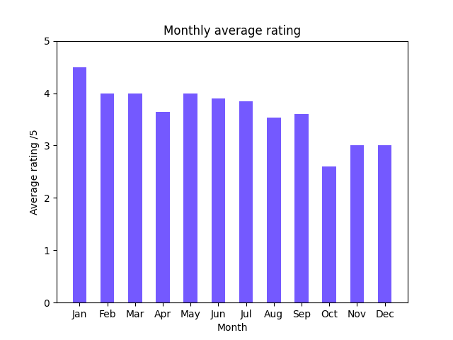
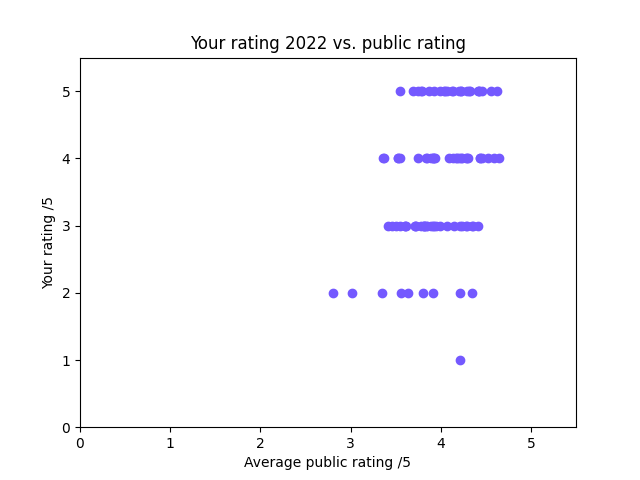
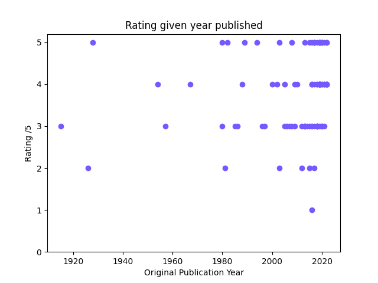
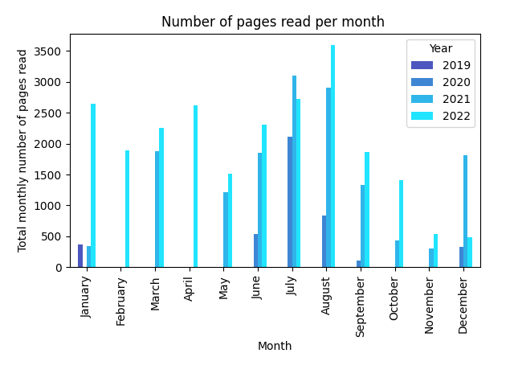

# goodreads-data-visualisation

**How to run**

Install Python 3.11.2 and install the requirements using `pip install -r requirements.txt`

You can either export a CSV file from a Goodreads account or use the example file included in the repository.
Run the following command to visualise a user's book ratings:

```
python -m plot_rating -g example_goodreads_library_export.csv
```

Run this command to visualise the amount of books read:

```
python -m plot_number_read -g example_goodreads_library_export.csv
```

Additional settings:

`-c` allows the user to specify the colour of the data points

 `-y` allows the user to filter data to a specified year, YYYY

 `-s` saves each plot as a png

**Example plots**








